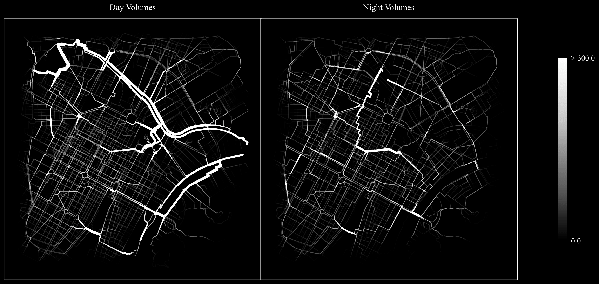

# PedSimCityNight #

## An Agent-Based Model (ABM) for simulating the movement of pedestrian agents in cities during they day and at nighttime ##
[](https://github.com/g-filomena/PedSimCity/actions/workflows/build.yaml)
[](https://www.gnu.org/licenses/gpl-3.0.en.html)

This model simulates the movement of pedestrians across the street network of large urban areas, comparing their movement flows during the day, and at night. It is here tested for the city of Torino, in the north of Italy. A city of 800'000 inhabitants. 



The repository contains all the resources necessary to prepare the input of the ABM, run the ABM itself, and analyse its results. Preaparation and analysis are detailed in two Jupyter Notebooks compiled in Python (see folder `/notebooks` in the repository).

## Executing the ABM

PedSimCityNight is developed in Java and built on the following libraries:
* [JTS](https://github.com/locationtech/jts)
* [Mason](https://cs.gmu.edu/~eclab/projects/mason/extensions/geomason/)
* [GeoMason-light](https://github.com/g-filomena/GeoMason-light)

Along with:
* [Apache Commons Lang](https://commons.apache.org/proper/commons-lang/download_lang.cgi)
* [OpenCsv](http://opencsv.sourceforge.net)
* [Java Tuples](https://www.javatuples.org)
* [SLF4J](https://www.slf4j.org)

**How to run the applet:**
1. Install Java on your machine.
2. Download the jar file *pedsimcityNight-1.0.0-jar-with-dependencies* wherever it is convenient.
3. Open the command prompt in the directory where the .jar file is placed.
4. Run the command *java -jar pedsimcityNight-1.0.0-jar-with-dependencies.jar*.
5. The applet should pop-up and log-messages should appear in the command prompt window.

**This is the recommended option for running PedSimCity and it does not require the user to take any other step or to manually install the dependencies.**

If the user desires to use the applet within Eclipse, for example, to explore the source files or to make changes, the following instructions should be followed:

1. Download the raw content of the Github `PedSimCityNight` Repository, as a .zip file.
2. Unzip the file and move the nested PedSimCityNight-Master folder wherever it is convenient. 
3. Open Eclipse, and create a new Java project; any name will do.
4. Right click on the project on the left-hand side *Package Explorer*. Select *Build Path*, *Link Source*, navigate to the PedSimCityNight-Master, navigate to and then select the folder *src/main/java* (without double clicking on it).
4. Import all the libraries mentioned above, manually, by right clicking on your project *Build Path*, *Add External Archives*.
5. To execute the applet, right-click on teh class ```PedSimCity.applet```, *Run as Java Application*.
6. Before pressing the *Run Simulation* button, click on *Other options* and copy-paste the entire path referring to the path *src/main/resources/* in the corresponding field. This is necessary for retrieving the input data.
